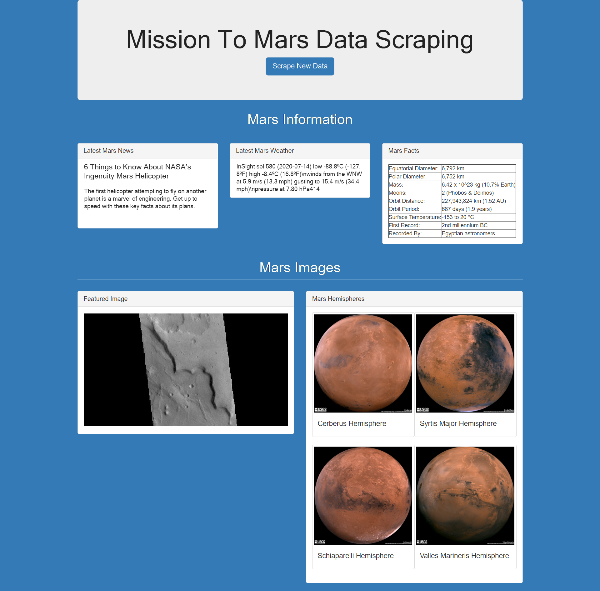

# Mars Data Web Scraping Project
 The objective of this project is to build a web application that scrapes various websites for data related to the Mission to Mars and displays the information in a single HTML page. Here are links to the various steps taken to complete this project.

### Resources
The following link to the various components of the project:
 * [`mission_to_mars.ipynb`](https://github.com/SaltireSequence/web-scraping-challenge/blob/master/mission_to_mars.ipynb) - this JupyterLab file contains all my scraping code.
 * [`Images`](https://github.com/SaltireSequence/web-scraping-challenge/tree/master/Images) - the Images folder contains a [`screenshot`](https://github.com/SaltireSequence/web-scraping-challenge/blob/master/Images/sample_page.png) of my application.
 * [`templates`](https://github.com/SaltireSequence/web-scraping-challenge/tree/master/templates) - the Templates folder contains my [`index.html`](https://github.com/SaltireSequence/web-scraping-challenge/blob/master/templates/index.html) file and [`scrape.html`](https://github.com/SaltireSequence/web-scraping-challenge/blob/master/templates/scrape.html) file.
 * [`app.py`](https://github.com/SaltireSequence/web-scraping-challenge/blob/master/app.py) - this is my app, that contains a 'home' and 'scrape. route.
* [`scrape_mars.py`](https://github.com/SaltireSequence/web-scraping-challenge/blob/master/scrape_mars.py) - this is my JupyterLab file, converted to a Python script, with a function called 'scrape' that will execute all of the  scraping code and return one Python dictionary containing all of the scraped data.



 ## Step 1 - Scraping
I created a Jupyter Notebook file called `mission_to_mars.ipynb` and used this to code (in Python) all of my scraping and analysis tasks. This included - 
 * Scraped the [NASA Mars News Site](https://mars.nasa.gov/news/) and collected the latest News Title and Paragraph Text. I assigned the text to variables for later reference later.
```python
nasa_headline = "NASA's Next Mars Mission to Investigate Interior of Red Planet"

nasa_para1 = "Preparation of NASA's next spacecraft to Mars, InSight, has ramped up this summer, on course for launch next May from Vandenberg Air Force Base in central California -- the first interplanetary launch in history from America's West Coast."
```

### Mars Facts

* I visited the Mars Facts webpage [here](https://space-facts.com/mars/) and used Pandas to scrape the table containing facts about the planet including Diameter, Mass, etc.

* Used Pandas to convert the data to a HTML table string.

### Mars Hemispheres

* Visited the USGS Astrogeology site [here](https://astrogeology.usgs.gov/search/results?q=hemisphere+enhanced&k1=target&v1=Mars) to obtain high resolution images for each of Mar's hemispheres.

* I used ```.click()``` to click each of the links to the hemispheres in order to find the image url to the full resolution image.

* Saved both the image url string for the full resolution hemisphere image, and the Hemisphere title containing the hemisphere name. Subsequently, I a Python dictionary to store the data using the keys `img_url` and `title`.

* Appended the dictionary with the image url string and the hemisphere title to a list. The list contained one dictionary for each hemisphere.

## Step 2 - MongoDB and Flask Application

MongoDB with Flask templating was used to create a new HTML page that displays all of the information that was scraped from the URLs above.

* The first task involved converting the JupyterLab file into a Python script called `scrape_mars.py` with a function called `scrape` that's purpose is execute all of the scraping code and return one Python dictionary containing all of the scraped data.

* Next, a route called `/scrape` was created that imported the `scrape_mars.py` script and called the `scrape` function.

* Store the return value in Mongo as a Python dictionary.

* Create a root route `/` that will query your Mongo database and pass the mars data into an HTML template to display the data.

* Create a template HTML file called `index.html` that will take the mars data dictionary and display all of the data in the appropriate HTML elements. Use the following as a guide for what the final product should look like, but feel free to create your own design.